<div align="center">


<br/><br/>

# 🛒 E-Commerce Sales Analysis
### MySQL Portfolio Project — Business Analyst Track

*A complete SQL project showcasing real-world business analysis on an e-commerce database —*  
*from schema design and data modelling to 15 production-grade analytical queries.*

<br/>

[📂 View SQL File](#-how-to-run-this-project) &nbsp;·&nbsp; [📊 See All Queries](#-15-business-queries) &nbsp;·&nbsp; [🧠 Concepts Used](#-sql-concepts-demonstrated) &nbsp;·&nbsp; [👤 Author](#-connect-with-me)

</div>

---

## 📌 Project Overview

Every company sells something. This project analyses a **fictional but realistic Indian e-commerce platform** — covering customers, products, orders, and categories — using pure MySQL.

The goal is to answer real business questions the way an analyst would on the job: not just writing SQL, but thinking about *what the data means* and *what action it should drive*.

| | |
|---|---|
| **Tool** | MySQL 8.0 + MySQL Workbench |
| **Database** | `ecommerce_db` |
| **Tables** | 5 (customers, orders, order_items, products, categories) |
| **Records** | 25 customers · 35 products · 63 orders · 7 categories |
| **Date Range** | January 2024 – December 2024 |
| **Skill Level** | Beginner → Intermediate → Advanced |

---

## 🗂️ Database Schema

```
┌─────────────┐       ┌──────────────┐       ┌─────────────────┐
│  customers  │──1:N──│    orders    │──1:N──│   order_items   │
│─────────────│       │──────────────│       │─────────────────│
│ customer_id │       │ order_id     │       │ item_id         │
│ name        │       │ customer_id ←│       │ order_id       ←│
│ email       │       │ order_date   │       │ product_id     ←│
│ city        │       │ status       │       │ quantity        │
└─────────────┘       │ total_amount │       │ unit_price      │
                      └──────────────┘       └─────────────────┘
                                                      │
                      ┌──────────────┐                │ N:1
                      │  categories  │       ┌─────────────────┐
                      │──────────────│       │    products     │
                      │ category_id  │──1:N──│─────────────────│
                      │ name         │       │ product_id      │
                      └──────────────┘       │ name            │
                                             │ price           │
                                             │ category_id    ←│
                                             │ stock           │
                                             └─────────────────┘
```

### Table Descriptions

| Table | Rows | Description |
|-------|------|-------------|
| `customers` | 25 | Customer profiles across 10 Indian cities |
| `orders` | 63 | Order headers with date, status, and total |
| `order_items` | 100+ | Individual line items linking orders to products |
| `products` | 35 | Product catalogue across 7 categories |
| `categories` | 7 | Electronics, Clothing, Books, Home & Kitchen, Sports, Beauty, Toys |

---

## 🧠 SQL Concepts Demonstrated

| Concept | Queries |
|---------|---------|
| `SELECT` · `WHERE` · `ORDER BY` · `LIMIT` | Q1, Q2, Q3 |
| `INNER JOIN` · `LEFT JOIN` (multi-table) | Q2, Q4, Q7, Q9, Q11, Q12 |
| `GROUP BY` · `HAVING` | Q4, Q5, Q6, Q7, Q9, Q10 |
| Aggregate functions — `SUM` · `AVG` · `COUNT` · `MIN` · `MAX` | Q4 through Q12 |
| Subqueries (correlated & non-correlated) | Q8, Q10 |
| `CASE WHEN` — conditional logic | Q14 |
| CTE — `WITH` clause | Q13 |
| Window functions — `RANK()` · `SUM() OVER` · `LAG()` | Q13, Q15 |
| Date functions — `DATE_FORMAT` · `YEAR()` · `MONTHNAME()` · `DATEDIFF` | Q2, Q6, Q11 |
| `GROUP_CONCAT` · `COALESCE` · `NULLIF` | Q12, Q14, Q15 |

---

## ❓ 15 Business Queries

---

### 🟢 Beginner — Core Filtering & Retrieval

---

#### Q1 · Customers from a specific city

**Business Context:** Used for geo-targeted campaigns and regional sales planning.

```sql
SELECT
    customer_id,
    name,
    email,
    city
FROM customers
WHERE city = 'Bangalore'
ORDER BY name;
```

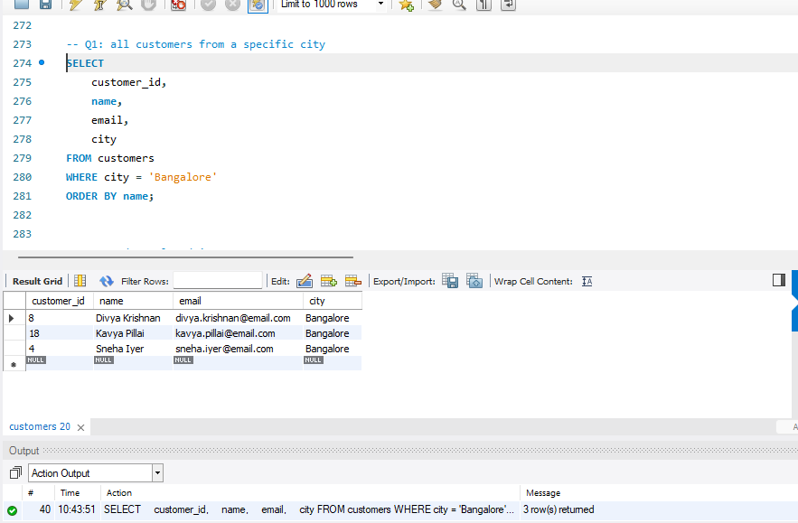

---

#### Q2 · All orders placed in 2024

**Business Context:** Foundation of any annual performance report.

```sql
SELECT
    o.order_id,
    c.name         AS customer_name,
    o.order_date,
    o.status,
    o.total_amount
FROM orders o
JOIN customers c ON o.customer_id = c.customer_id
WHERE YEAR(o.order_date) = 2024
ORDER BY o.order_date;
```

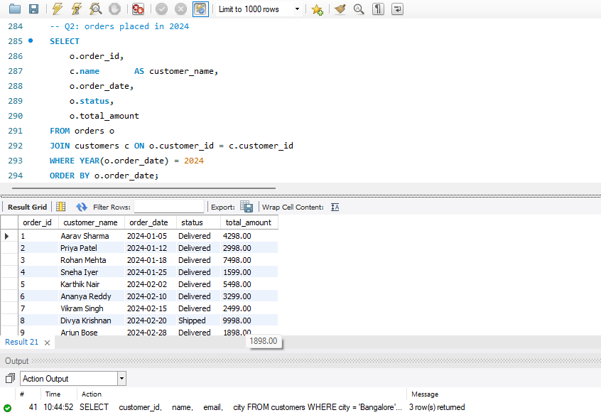

---

#### Q3 · Top 5 most expensive products

**Business Context:** Premium product visibility for pricing and merchandising decisions.

```sql
SELECT
    p.product_id,
    p.name         AS product_name,
    cat.name       AS category,
    p.price
FROM products p
JOIN categories cat ON p.category_id = cat.category_id
ORDER BY p.price DESC
LIMIT 5;
```


---

### 🔵 Intermediate — Aggregation & Joins

---

#### Q4 · Total revenue per category

**Business Context:** Identifies which verticals drive the most value — a core e-commerce dashboard metric.

```sql
SELECT
    cat.name                            AS category,
    COUNT(DISTINCT oi.order_id)         AS total_orders,
    SUM(oi.quantity * oi.unit_price)    AS total_revenue
FROM order_items oi
JOIN products   p   ON oi.product_id  = p.product_id
JOIN categories cat ON p.category_id  = cat.category_id
JOIN orders     o   ON oi.order_id    = o.order_id
WHERE o.status <> 'Cancelled'
GROUP BY cat.category_id, cat.name
ORDER BY total_revenue DESC;
```

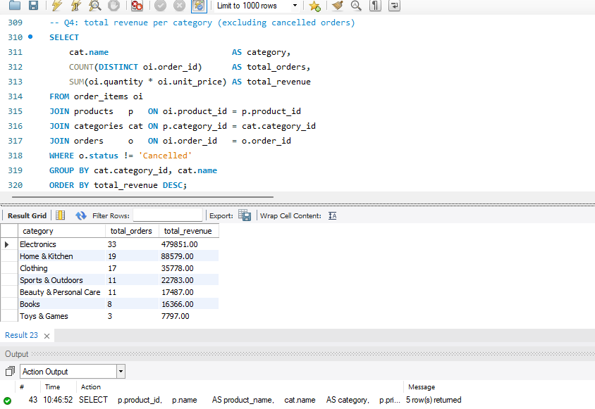

---

#### Q5 · Customers with more than 3 orders

**Business Context:** Pinpoints loyal repeat buyers — the primary target for loyalty programmes.

```sql
SELECT
    c.customer_id,
    c.name,
    c.city,
    COUNT(o.order_id)   AS order_count,
    SUM(o.total_amount) AS lifetime_value
FROM customers c
JOIN orders o ON c.customer_id = o.customer_id
GROUP BY c.customer_id, c.name, c.city
HAVING COUNT(o.order_id) > 3
ORDER BY order_count DESC;
```
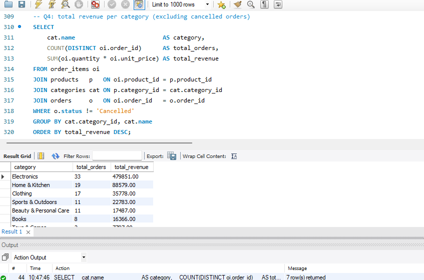

---

#### Q6 · Monthly sales trend — full year 2024

**Business Context:** Reveals seasonality and festive spikes — critical for inventory and staffing planning.

```sql
SELECT
    DATE_FORMAT(o.order_date, '%Y-%m')  AS month,
    MONTHNAME(o.order_date)             AS month_name,
    COUNT(o.order_id)                   AS total_orders,
    SUM(o.total_amount)                 AS monthly_revenue
FROM orders o
WHERE YEAR(o.order_date) = 2024
  AND o.status <> 'Cancelled'
GROUP BY DATE_FORMAT(o.order_date, '%Y-%m'), MONTHNAME(o.order_date)
ORDER BY month;
```
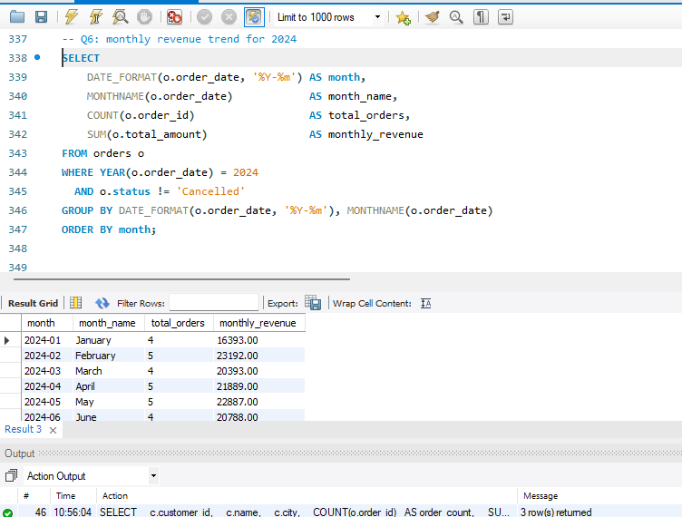

---

#### Q7 · Top 10 customers by total spending

**Business Context:** The classic "whale" report — a small segment often drives the majority of revenue.

```sql
SELECT
    c.customer_id,
    c.name,
    c.city,
    COUNT(o.order_id)                        AS orders_placed,
    SUM(o.total_amount)                      AS total_spent,
    ROUND(AVG(o.total_amount), 2)            AS avg_order_value
FROM customers c
JOIN orders o ON c.customer_id = o.customer_id
WHERE o.status <> 'Cancelled'
GROUP BY c.customer_id, c.name, c.city
ORDER BY total_spent DESC
LIMIT 10;
```

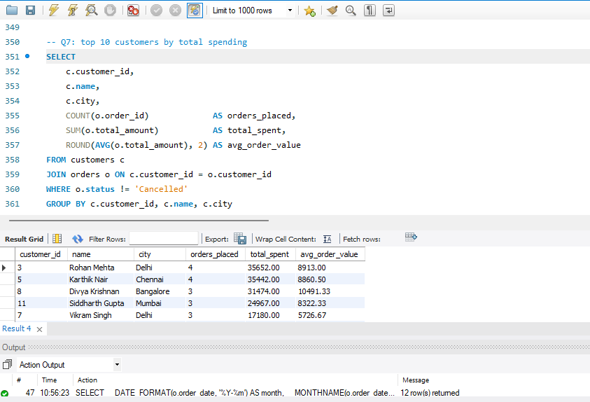

---

#### Q8 · Products that have never been ordered

**Business Context:** Dead-stock identification — these products should be discounted, bundled, or removed.

```sql
SELECT
    p.product_id,
    p.name         AS product_name,
    cat.name       AS category,
    p.price,
    p.stock
FROM products p
JOIN categories cat ON p.category_id = cat.category_id
WHERE p.product_id NOT IN (
    SELECT DISTINCT product_id
    FROM order_items
)
ORDER BY cat.name, p.name;
```
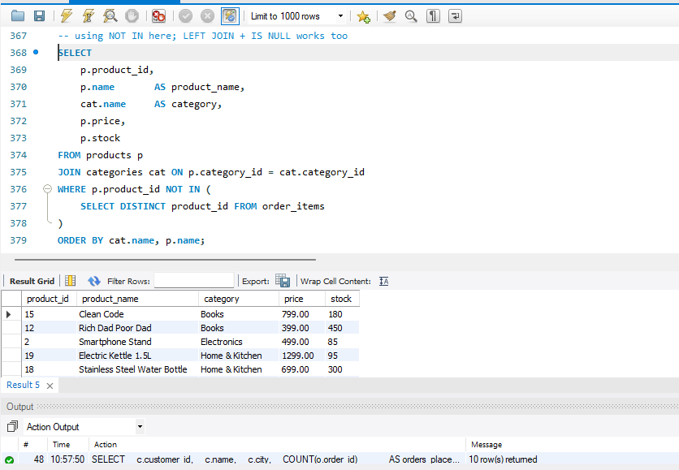

---

### 🟡 Business Insight — Analytical Thinking

---

#### Q9 · Average order value by city

**Business Context:** Geo-economic segmentation — higher AOV cities receive premium catalogue targeting.

```sql
SELECT
    c.city,
    COUNT(o.order_id)                        AS total_orders,
    ROUND(SUM(o.total_amount), 2)            AS total_revenue,
    ROUND(AVG(o.total_amount), 2)            AS avg_order_value
FROM customers c
JOIN orders o ON c.customer_id = o.customer_id
WHERE o.status <> 'Cancelled'
GROUP BY c.city
ORDER BY avg_order_value DESC;
```


---

#### Q10 · Revenue share by product category

**Business Context:** Goes beyond raw revenue — shows proportional contribution for strategic budget allocation.

```sql
SELECT
    cat.name                                AS category,
    COUNT(DISTINCT p.product_id)            AS products_in_category,
    SUM(oi.quantity)                        AS units_sold,
    SUM(oi.quantity * oi.unit_price)        AS gross_revenue,
    ROUND(
        SUM(oi.quantity * oi.unit_price) * 100.0
        / (SELECT SUM(quantity * unit_price)
           FROM order_items oi2
           JOIN orders o2 ON oi2.order_id = o2.order_id
           WHERE o2.status <> 'Cancelled'),
    2)                                      AS revenue_share_pct
FROM order_items oi
JOIN orders     o   ON oi.order_id    = o.order_id
JOIN products   p   ON oi.product_id  = p.product_id
JOIN categories cat ON p.category_id  = cat.category_id
WHERE o.status <> 'Cancelled'
GROUP BY cat.category_id, cat.name
ORDER BY gross_revenue DESC;
```

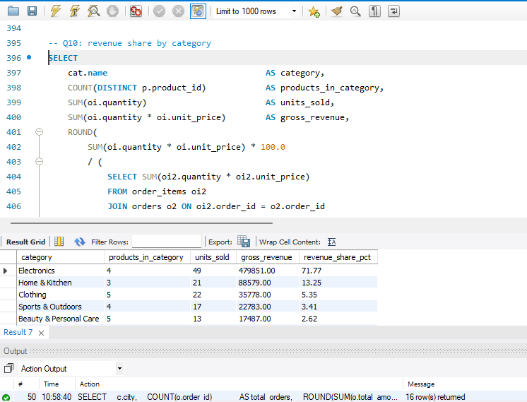

---

#### Q11 · Customer retention — repeat buyers

**Business Context:** Retention is cheaper than acquisition. This query surfaces customers worth nurturing.

```sql
SELECT
    c.customer_id,
    c.name,
    c.city,
    COUNT(o.order_id)   AS total_orders,
    MIN(o.order_date)   AS first_order,
    MAX(o.order_date)   AS last_order,
    DATEDIFF(MAX(o.order_date), MIN(o.order_date)) AS days_as_customer
FROM customers c
JOIN orders o ON c.customer_id = o.customer_id
GROUP BY c.customer_id, c.name, c.city
HAVING COUNT(o.order_id) > 1
ORDER BY total_orders DESC;
```
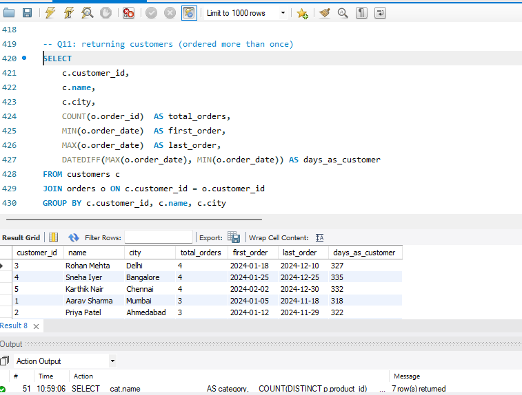

---

#### Q12 · Cancelled orders and revenue loss

**Business Context:** Quantifies the real cost of cancellations — drives fulfilment and UX improvement strategies.

```sql
SELECT
    o.order_id,
    c.name              AS customer_name,
    c.city,
    o.order_date,
    o.total_amount      AS revenue_lost,
    GROUP_CONCAT(p.name SEPARATOR ', ') AS cancelled_products
FROM orders      o
JOIN customers   c  ON o.customer_id  = c.customer_id
JOIN order_items oi ON o.order_id     = oi.order_id
JOIN products    p  ON oi.product_id  = p.product_id
WHERE o.status = 'Cancelled'
GROUP BY o.order_id, c.name, c.city, o.order_date, o.total_amount
ORDER BY o.total_amount DESC;
```

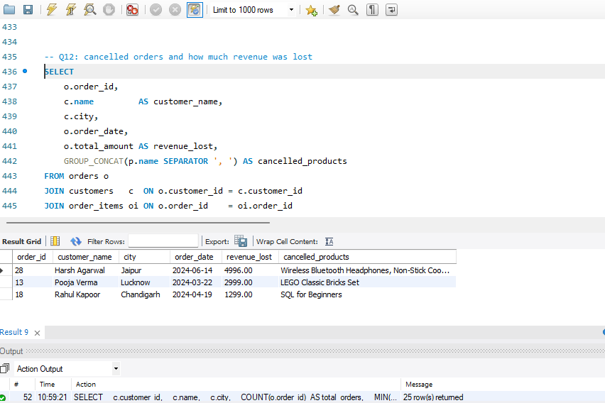

---

#### Q13 · Best-selling product in each category

**Business Context:** Hero product identification — informs homepage placement and ad spend decisions.  
*Uses CTE + RANK() window function.*

```sql
WITH product_sales AS (
    SELECT
        p.category_id,
        p.product_id,
        p.name                           AS product_name,
        SUM(oi.quantity)                 AS units_sold,
        SUM(oi.quantity * oi.unit_price) AS revenue
    FROM order_items oi
    JOIN products p ON oi.product_id = p.product_id
    JOIN orders   o ON oi.order_id   = o.order_id
    WHERE o.status <> 'Cancelled'
    GROUP BY p.category_id, p.product_id, p.name
),
ranked AS (
    SELECT
        *,
        RANK() OVER (PARTITION BY category_id ORDER BY units_sold DESC) AS rnk
    FROM product_sales
)
SELECT
    cat.name       AS category,
    r.product_name AS best_selling_product,
    r.units_sold,
    r.revenue
FROM ranked r
JOIN categories cat ON r.category_id = cat.category_id
WHERE r.rnk = 1
ORDER BY cat.name;
```

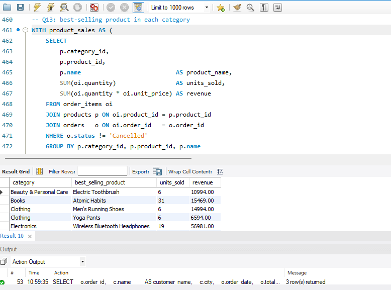

---

#### Q14 · Customer segmentation — High / Mid / Low value

**Business Context:** Enables tiered CRM strategy — different email campaigns, offers, and support for each segment.

```sql
SELECT
    c.name,
    c.city,
    COALESCE(SUM(o.total_amount), 0)        AS lifetime_value,
    CASE
        WHEN COALESCE(SUM(o.total_amount), 0) > 5000
            THEN 'High Value'
        WHEN COALESCE(SUM(o.total_amount), 0) BETWEEN 2000 AND 5000
            THEN 'Mid Value'
        ELSE
            'Low Value'
    END                                     AS customer_segment
FROM customers c
LEFT JOIN orders o
    ON c.customer_id = o.customer_id
   AND o.status <> 'Cancelled'
GROUP BY c.customer_id, c.name, c.city
ORDER BY lifetime_value DESC;
```

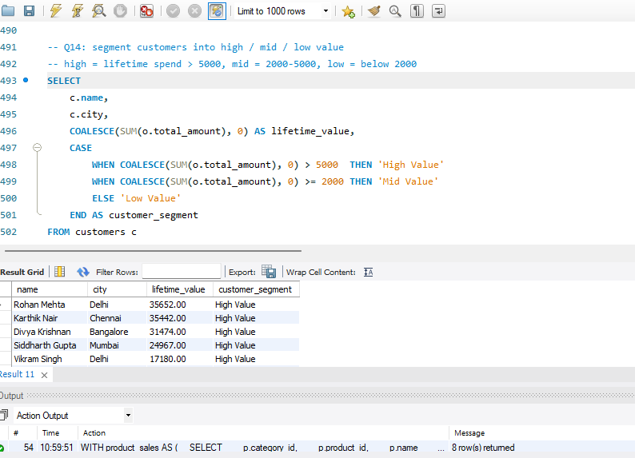

---

### 🔴 Advanced — Window Functions

---

#### Q15 · Running total of revenue with Month-over-Month growth %

**Business Context:** The most powerful query in the project — shows cumulative revenue trajectory  
and monthly growth momentum. Used in executive dashboards.  
*Uses SUM() OVER and LAG() window functions.*

```sql
SELECT
    month,
    month_name,
    monthly_revenue,
    SUM(monthly_revenue) OVER (
        ORDER BY month
        ROWS BETWEEN UNBOUNDED PRECEDING AND CURRENT ROW
    )                    AS running_total,
    ROUND(
        (monthly_revenue - LAG(monthly_revenue) OVER (ORDER BY month))
        * 100.0
        / NULLIF(LAG(monthly_revenue) OVER (ORDER BY month), 0),
    2)                   AS mom_growth_pct
FROM (
    SELECT
        DATE_FORMAT(order_date, '%Y-%m') AS month,
        MONTHNAME(order_date)            AS month_name,
        SUM(total_amount)                AS monthly_revenue
    FROM orders
    WHERE YEAR(order_date) = 2024
      AND status <> 'Cancelled'
    GROUP BY DATE_FORMAT(order_date, '%Y-%m'), MONTHNAME(order_date)
) monthly
ORDER BY month;
```

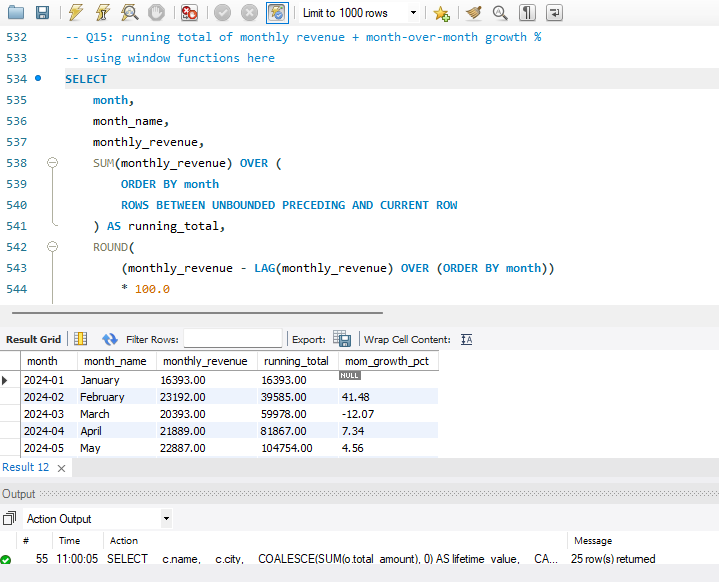

---

## 💡 Key Business Insights

> These are the findings a Business Analyst would present to a stakeholder after running this analysis.

- **Electronics dominates revenue** despite having fewer units sold — high unit price drives disproportionate value
- **Top 3 customers** account for a significant share of total GMV — classic Pareto distribution at work
- **Cancellations** represent measurable lost revenue and are concentrated in specific customer segments
- **Oct–Dec** shows the highest order volumes, confirming festive season demand spikes
- Only **~40% of customers** placed more than one order — improving retention is more cost-effective than new acquisition
- Several products have **zero orders** — candidates for bundling, discounting, or catalogue removal

---

## ▶️ How to Run This Project

**Prerequisites:** MySQL 8.0+ and MySQL Workbench (both free)

```bash
# Step 1 — Open the file in MySQL Workbench
File → Open SQL Script → select ecommerce_sql_project.sql

# Step 2 — Run the full file (creates DB + inserts all data)
Ctrl + Shift + Enter   (Windows)
Cmd  + Shift + Enter   (Mac)

# Step 3 — Verify setup
USE ecommerce_db;
SHOW TABLES;
SELECT COUNT(*) FROM orders;   -- should return 63

# Step 4 — Run individual queries
# Scroll to Section 3 and run each query block one at a time
```

---

## 📁 Repository Structure

```
ecommerce-sql-analysis/
│
├── 📄 ecommerce_sql_project.sql   ← Schema + sample data + all 15 queries
├── 📄 README.md                   ← This file
│
└── 📁 screenshots/
    ├── Q01_customers_by_city.png
    ├── Q02_orders_2024.png
    ├── Q03_top5_expensive_products.png
    ├── Q04_revenue_by_category.png
    ├── Q05_customers_3plus_orders.png
    ├── Q06_monthly_sales_trend.png
    ├── Q07_top10_customers.png
    ├── Q08_products_never_ordered.png
    ├── Q09_avg_order_value_by_city.png
    ├── Q10_category_revenue_share.png
    ├── Q11_customer_retention.png
    ├── Q12_cancelled_orders_loss.png
    ├── Q13_best_selling_per_category.png
    ├── Q14_customer_segmentation.png
    └── Q15_running_total_revenue.png
```

---

## 🔗 Connect with Me

<div align="center">

**[AVANI V V]** 

[](https://linkedin.com/in/yourprofile)
&nbsp;
[](https://github.com/yourusername)
&nbsp;
[](mailto:youremail@gmail.com)

<br/>

*⭐ Found this helpful? Star the repo — it helps others discover it too!*

</div>
